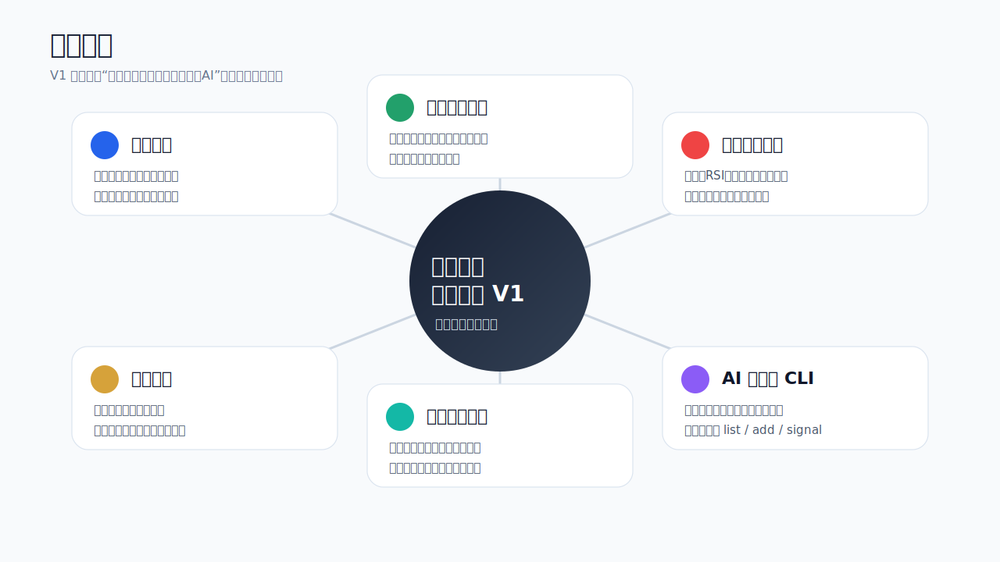
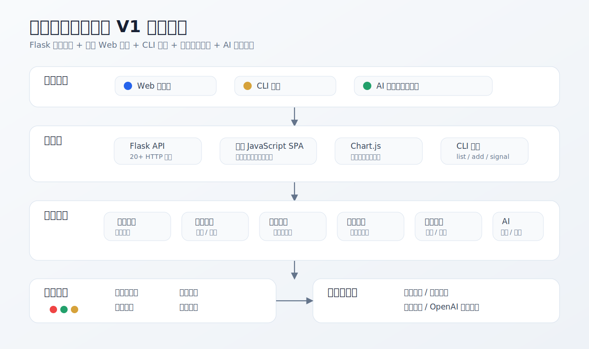
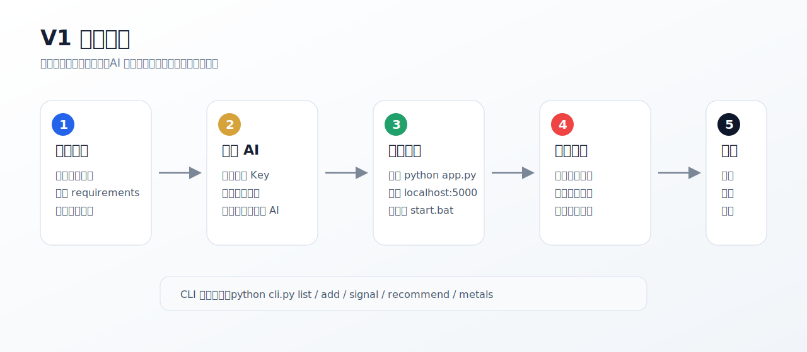

# 基金收益预测助手 V1 图文产品介绍

基金收益预测助手 V1 是一款面向个人投资者和技术学习场景的本地基金分析工具。它把基金持仓、实时估值、净值走势、市场行情、贵金属价格、量化信号、基金推荐和 AI 辅助分析集中到一个轻量 Web 应用中，并提供 CLI 命令行入口。

本产品不提供投资建议，所有结果仅用于辅助分析和技术研究。

## 1. 产品定位

V1 版本强调“本地可运行、功能闭环完整、易于展示和二次开发”。用户可以在浏览器中查看基金组合，也可以在终端中快速查询持仓、买卖信号和推荐基金。系统使用公开金融数据接口进行行情聚合，并通过 OpenAI 兼容接口提供 AI 对话和图片识别能力。

## 2. 功能总览

### 2.1 持仓管理

- 手动添加、删除基金持仓。
- 文本批量导入基金代码、金额和收益信息。
- 使用 AI Vision 识别持仓截图并导入。
- 统计总资产、今日估算收益、累计收益、持仓数量和组合收益率。

### 2.2 基金实时分析

- 获取基金实时估值、单位净值、估算涨跌幅和更新时间。
- 查看历史净值走势和阶段收益表现。
- 查看基金重仓股明细，辅助判断基金波动来源。

### 2.3 多因子买卖信号

系统通过多个技术与风险因子对基金进行评分，并输出买入、观望或卖出倾向。

| 因子 | 作用 |
| --- | --- |
| 均线位置 | 判断当前净值相对 MA20、MA60、MA120、MA250 的趋势位置 |
| RSI 指标 | 识别短期超买或超卖状态 |
| 近期动量 | 衡量 5 日、10 日、20 日收益变化 |
| 历史回撤 | 评估当前净值相对阶段高点的回撤程度 |
| 历史分位 | 判断当前净值在历史区间中的位置 |

### 2.4 智能基金推荐

- 从公开基金排名数据中构建候选池。
- 结合收益能力、风险控制、夏普表现、收益一致性和技术面进行综合评分。
- 输出推荐列表及评分，便于进一步人工筛选。

### 2.5 市场与贵金属行情

- 展示上证指数、深证成指、创业板指等主要市场指数。
- 展示热门板块行情。
- 展示黄金、白银等贵金属价格和趋势数据。

### 2.6 AI 助手

- 支持中文分析对话和流式响应。
- 支持从自然语言文本中提取基金持仓信息。
- 支持图片识别持仓截图。
- AI 未配置时，基础行情和量化分析仍可运行。

## 3. 系统架构

项目采用 Flask 单体后端，前端为原生 JavaScript SPA。核心业务逻辑集中在 `app.py` 中，命令行工具 `cli.py` 复用后端数据抓取与分析函数。通过 `ratelimit.py` 控制外部数据接口访问频率，避免短时间内请求过多。

## 4. 使用路径

标准使用流程：

1. 安装 Python 依赖。
2. 可选配置 AI 环境变量。
3. 运行 `python app.py` 启动服务。
4. 访问 `http://localhost:5000`。
5. 添加或导入基金持仓。
6. 查看组合收益、基金详情、信号评分、推荐基金和市场行情。
7. 需要终端操作时使用 `python cli.py --help`。

## 5. 技术实现

| 层级 | 实现 |
| --- | --- |
| 用户入口 | Web 浏览器、CLI 终端 |
| 应用层 | Flask API、原生 JavaScript SPA、Chart.js 图表 |
| 业务层 | 基金估值抓取、历史净值分析、重仓股查询、买卖信号、推荐评分、AI 对话 |
| 基础层 | 令牌桶限流、多级缓存、接口容错、本地配置 |
| 数据源 | 东方财富、天天基金、新浪财经、OpenAI 兼容服务 |

## 6. 文件说明

| 文件 | 说明 |
| --- | --- |
| `app.py` | Flask 后端入口，包含 API 路由、数据抓取、AI 调用和量化分析逻辑 |
| `cli.py` | 命令行工具，复用后端能力完成持仓、信号、推荐和贵金属查询 |
| `ratelimit.py` | 令牌桶限流器，控制外部接口访问频率 |
| `config.example.json` | 配置模板 |
| `requirements.txt` | Python 依赖 |
| `start.bat` | Windows 一键启动脚本 |
| `templates/index.html` | Web 页面模板 |
| `static/js/app.js` | 前端主逻辑 |
| `static/css/style.css` | 前端样式 |
| `docs/assets/` | 图文介绍使用的图片和 SVG 资产 |
| `README.md` | 安装、配置、运行和 API 文档 |

## 7. V1 范围与限制

V1 版本以本地单机使用为主，重点完成完整功能闭环，而不是多人账户、云端部署或交易执行。

当前限制：

- 外部数据接口可能因网络、限流或接口变化而不可用。
- Web 持仓存储在 localStorage 中，不适合作为长期唯一备份。
- 价格提醒保存在内存中，服务重启后会清空。
- AI 能力依赖独立服务和密钥配置。
- 所有投资分析结果仅供参考。

## 8. 后续可扩展方向

- 增加数据库持久化和用户账户体系。
- 增加基金组合回测能力。
- 增加持仓导出和报告生成功能。
- 增加更多风险指标，如最大回撤、波动率、相关性和行业集中度。
- 增加 Docker 部署配置。
- 增加自动化测试和 CI 流程。
