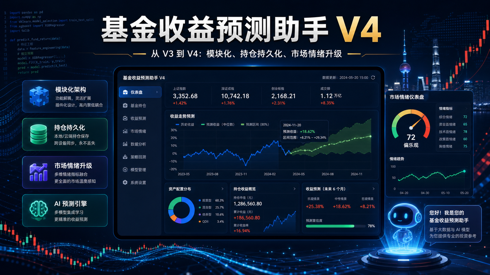
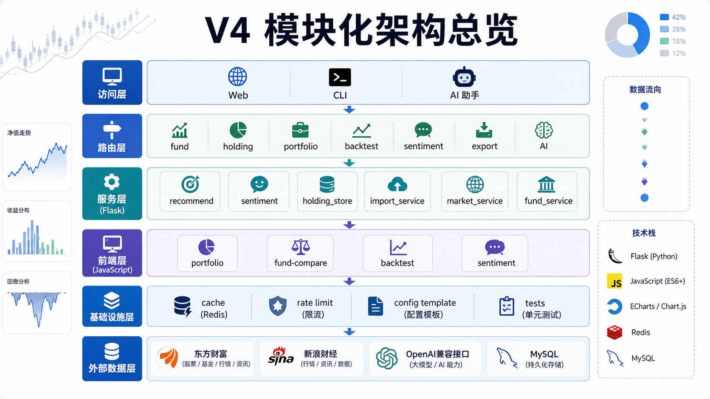
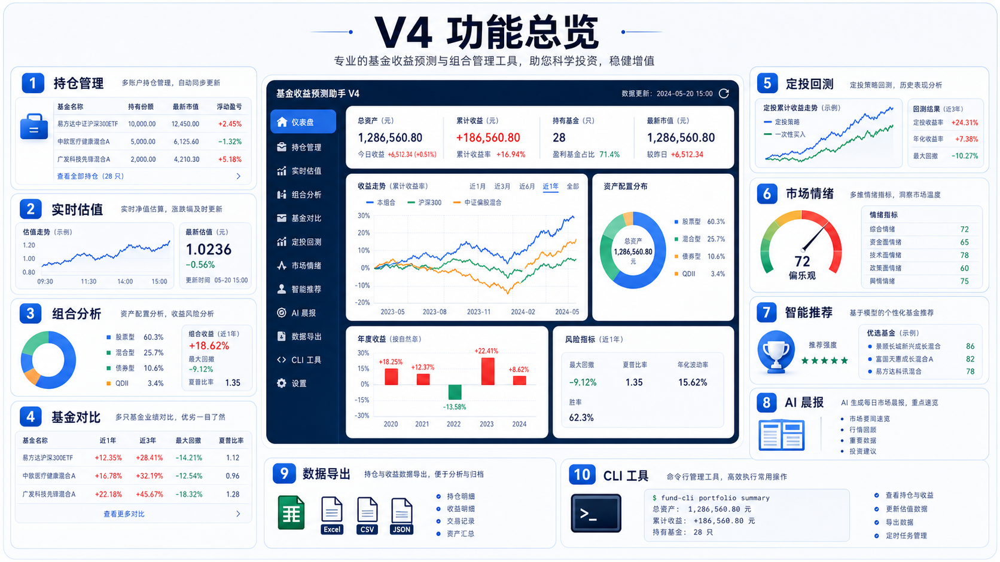
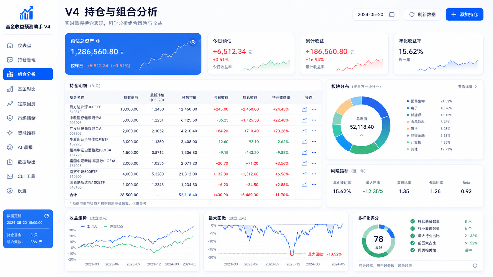
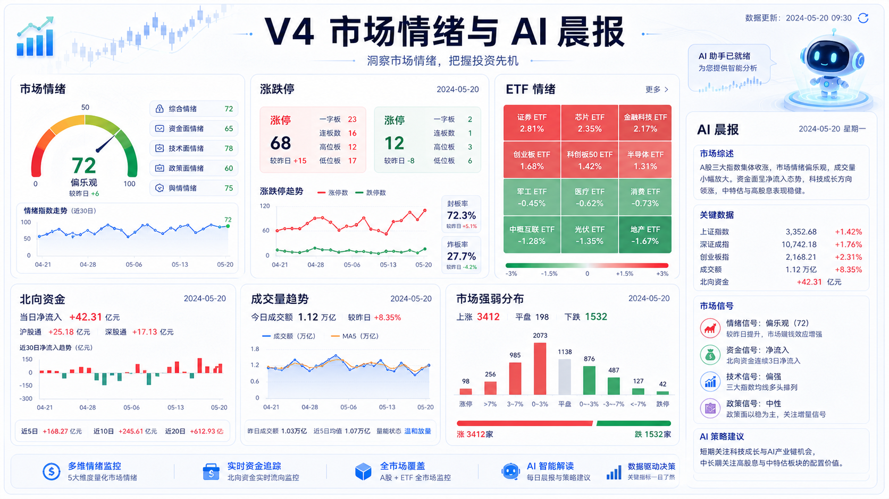
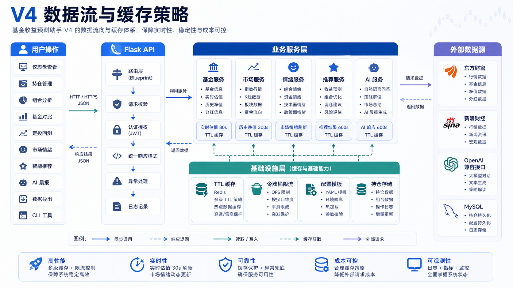

# 基金收益预测助手 V4



基金收益预测助手 V4 是一个面向个人投资者的本地化基金分析与投资辅助平台。系统围绕基金持仓、实时估值、组合分析、基金对比、定投回测、市场情绪、AI 晨报、数据导出和 AI 投资助手构建，适合在本地或个人服务器中运行。

项目采用 Python Flask 后端、原生 JavaScript 前端、Chart.js 图表、多源金融数据接口和 OpenAI 兼容 AI 接口。V4 的核心目标是：功能完整、结构清晰、配置安全、便于二次开发。

> 免责声明：本项目仅用于学习、研究和个人投资辅助分析，不构成任何投资建议。基金、股票、贵金属等金融资产存在风险，实际投资决策请自行判断并承担风险。

## V4 版本定位

V4 是当前主版本，重点围绕三个方向建设：

- **投资分析完整性**：覆盖持仓、估值、组合、对比、回测、市场情绪和 AI 辅助。
- **工程结构清晰性**：后端按路由、服务、量化、缓存、限流拆分；前端按业务视图拆分。
- **公开发布安全性**：仓库只保留配置模板，真实密钥、数据库密码和本地持仓数据不进入 Git。

## V4 模块化架构



V4 按访问层、路由层、服务层、前端模块、基础设施和外部数据源组织代码。

```text
Web / CLI / AI 助手
    |
    v
Flask 路由层
    |-- fund_routes.py
    |-- holding_routes.py
    |-- portfolio_routes.py
    |-- backtest_routes.py
    |-- sentiment_routes.py
    |-- export_routes.py
    |-- ai_routes.py
    `-- morning_report_routes.py
    |
    v
业务服务层
    |-- fund_service.py
    |-- market_service.py
    |-- holding_store.py
    |-- import_service.py
    |-- recommend/
    |-- sentiment/
    |-- backtest_service.py
    |-- ai_service.py
    `-- morning_report_service.py
    |
    v
基础能力
    |-- cache.py
    |-- ratelimit.py
    |-- config.py
    |-- config.example.json
    `-- tests/
```

## V4 功能总览



### 1. 持仓管理

- 添加、删除和查看基金持仓。
- 支持后端持仓 API。
- 支持本地持仓数据文件。
- 支持 MySQL 持仓存储配置。
- 持仓数据可用于组合统计、组合分析和 AI 晨报。

### 2. 实时估值

- 根据基金代码获取基金名称、净值、估值、涨跌幅。
- 支持批量获取多只基金数据。
- 对外部行情接口增加缓存和限流，降低请求压力。
- 页面自动汇总预估总资产、今日预估收益、累计收益和收益率。

### 3. 组合分析



- 统计组合总资产、成本、收益和收益率。
- 分析基金类型分布、行业板块分布、重仓股重合度。
- 计算组合风险指标、最大回撤和多样化评分。
- 提供板块集中度提示，辅助识别组合过度集中风险。

### 4. 基金对比

- 支持多只基金横向比较。
- 展示阶段收益、估值走势、重仓股、信号和关键指标。
- 前端模块拆分为 API、状态、图表、事件、弹窗和视图文件，便于扩展更多对比维度。

### 5. 定投回测

- 支持按历史净值模拟定投策略。
- 展示累计投入、资产变化、收益结果和回测曲线。
- 支持策略参数化，便于对不同定投方式进行复盘。

### 6. 市场情绪



- 跟踪大盘涨跌家数、涨跌停、成交量、北向资金、ETF 情绪等指标。
- 服务层拆分为市场概览、涨跌停、ETF、成交量、数据存储和后台刷新模块。
- 对主备数据源和异常返回提供 fallback 处理。

### 7. 智能推荐

- 从基金池中筛选候选基金。
- 使用快速评分和综合评分评估基金。
- 推荐逻辑拆分为候选池模块和评分模块，便于调整权重、指标和筛选规则。

### 8. AI 晨报与 AI 助手

- 支持 OpenAI 兼容 API。
- 支持 AI 聊天、持仓分析、图片识别和晨报生成。
- 可通过环境变量覆盖 AI 地址、密钥和模型。

### 9. 数据导出

- 支持将持仓、分析结果或业务数据导出。
- 便于在表格、报告或其他分析工具中继续处理。

### 10. CLI 命令行

除 Web 页面外，项目提供 `src/cli.py`，可在终端中管理持仓和查看分析结果。

```bash
python cli.py list
python cli.py add 000001 --value 10000 --profit 500
python cli.py remove 000001
python cli.py signal 000001
python cli.py recommend
python cli.py metals
python cli.py config
```

## V4 工程亮点



- **服务层拆分**：推荐、情绪、导入、持仓存储均独立成模块。
- **前端模块化**：组合分析、基金对比、定投回测、市场情绪按视图拆分。
- **缓存与限流**：通过 TTL 缓存和令牌桶限流保护外部行情接口。
- **配置模板化**：公开仓库只提交 `config.example.json`，真实配置本地维护。
- **测试覆盖**：包含组合分析、板块分类、市场情绪解析和 fallback 行为测试。
- **双入口使用**：支持 Web 应用和 CLI 命令行。

## 目录结构

```text
.
|-- README.md
|-- docs/
|   |-- PRODUCT.md
|   |-- PROJECT_DIAGRAMS.md
|   |-- PROJECT_DIAGRAMS.drawio
|   `-- images/
|       |-- v4-hero-cover.png
|       |-- v4-modular-architecture.png
|       |-- v4-feature-overview.png
|       |-- v4-data-flow.png
|       |-- v4-portfolio-analysis.png
|       `-- v4-sentiment-ai.png
|-- src/
|   |-- app.py
|   |-- cli.py
|   |-- cache.py
|   |-- config.py
|   |-- config.example.json
|   |-- ratelimit.py
|   |-- requirements.txt
|   |-- routes/
|   |-- services/
|   |-- quant/
|   |-- static/
|   |-- templates/
|   `-- tests/
`-- skills-lock.json
```

## 环境要求

- Python 3.10 或更高版本。
- Windows、macOS 或 Linux。
- 可访问东方财富、新浪财经等外部数据源。
- 如需 AI 功能，需要 OpenAI 兼容接口和 API Key。
- 如需 MySQL 持仓持久化，需要可用的 MySQL 服务。

## 快速开始

### 1. 克隆仓库

```bash
git clone git@github.com:ningwangyu/turbo-umbrella.git
cd turbo-umbrella/src
```

### 2. 创建虚拟环境并安装依赖

Windows PowerShell：

```powershell
python -m venv .venv
.\.venv\Scripts\Activate.ps1
pip install -r requirements.txt
```

macOS / Linux：

```bash
python -m venv .venv
source .venv/bin/activate
pip install -r requirements.txt
```

### 3. 创建本地配置

```bash
cp config.example.json config.json
```

Windows PowerShell：

```powershell
Copy-Item config.example.json config.json
```

然后按需修改 `config.json` 中的 AI 接口、数据库和服务端口。AI API 的地址和密钥分别对应 `ai.base_url`、`ai.api_key`，可在该文件中修改。`config.json` 已被 `.gitignore` 忽略，不会进入公开提交。

也可以用环境变量覆盖 AI 配置：

```bash
export AI_BASE_URL="http://localhost:7361"
export AI_API_KEY="you_apikey"
export AI_MODEL="gpt-5.5"
```

Windows PowerShell：

```powershell
$env:AI_BASE_URL="http://localhost:7361"
$env:AI_API_KEY="you_apikey"
$env:AI_MODEL="gpt-5.5"
```

### 4. 启动应用

```bash
python app.py
```

浏览器访问：

```text
http://localhost:5000
```

Windows 用户也可以运行：

```powershell
.\start.bat
```

## 配置说明

`src/config.example.json` 是可提交的配置模板，`src/config.json` 是本地私密配置。需要更换 AI API URL 或 Key 时，修改本地 `src/config.json` 中的 `ai.base_url` 和 `ai.api_key`；部署环境也可以通过 `AI_BASE_URL`、`AI_API_KEY` 覆盖。

| 配置路径 | 说明 |
| --- | --- |
| `ai.base_url` | OpenAI 兼容 API 地址 |
| `ai.api_key` | AI 服务密钥，建议通过环境变量传入 |
| `ai.model` | AI 模型名称 |
| `api.eastmoney.*` | 东方财富接口配置 |
| `api.sina.*` | 新浪财经接口配置 |
| `cache.*` | 各类数据缓存时间 |
| `database.mysql.*` | MySQL 连接配置 |
| `recommend.*` | 推荐池规模、并发数和超时时间 |
| `server.host` / `server.port` | Flask 服务监听地址和端口 |

## API 概览

| 接口 | 方法 | 说明 |
| --- | --- | --- |
| `/api/fund/<code>` | GET | 获取单只基金估值 |
| `/api/fund/batch` | POST | 批量获取基金数据 |
| `/api/fund/search` | GET | 基金搜索 |
| `/api/fund/holdings/<code>` | GET | 获取基金重仓股 |
| `/api/fund/performance/<code>` | GET | 获取历史走势 |
| `/api/fund/signal/<code>` | GET | 获取多因子买卖信号 |
| `/api/fund/recommend` | GET | 获取基金推荐 |
| `/api/holding/*` | GET/POST | 持仓管理 |
| `/api/portfolio/stats` | POST | 获取组合统计 |
| `/api/portfolio/analysis` | POST | 获取组合分析 |
| `/api/market/index` | GET | 获取市场指数 |
| `/api/market/sectors` | GET | 获取热门板块 |
| `/api/sentiment/*` | GET | 获取市场情绪相关数据 |
| `/api/backtest/*` | GET/POST | 定投回测 |
| `/api/ai/chat` | POST | AI 对话 |
| `/api/ai/recognize-image` | POST | 图片识别 |
| `/api/export/*` | GET/POST | 数据导出 |
| `/api/report/*` | GET/POST | 晨报生成 |

实际接口以 `src/routes/` 中的路由定义为准。

## 测试

在 `src` 目录运行：

```bash
pytest
```

当前测试覆盖组合分析、板块分类和市场情绪解析。涉及外部行情接口的功能建议通过 mock 或测试环境数据验证，避免测试结果受网络波动影响。

## 部署建议

### 本地部署

```bash
cd src
python app.py
```

### 服务器部署

生产环境建议：

- 使用 Gunicorn、uWSGI 或 Waitress 承载 Flask 应用。
- 使用 Nginx 做反向代理。
- 将 `AI_API_KEY`、数据库密码等敏感信息放到环境变量或服务器私密配置中。
- 关闭 Flask debug 模式。
- 对外开放前增加身份认证或访问控制。

## 安全注意事项

- 不要提交 `src/config.json`、`.env`、数据库文件和本地持仓文件。
- AI Key、数据库密码和代理地址应通过环境变量或私密配置管理。
- 本项目会调用第三方金融数据源，接口可用性和返回格式可能变化。
- 如果仓库历史中曾经提交过真实密钥，应立即吊销旧密钥并重新生成。

## 维护建议

- 新功能按路由、服务、前端模块分别拆分，保持 `routes/` 只处理请求和响应。
- 外部 API 调用统一放在 `services/`，并加缓存、超时和容错。
- 复杂计算放在 `quant/` 或独立 service 中，便于测试。
- 前端大型功能继续按 `src/static/js/<feature>/` 模块化拆分。
- 涉及金融数据的逻辑必须保留异常兜底，避免单个数据源失败导致页面整体不可用。
