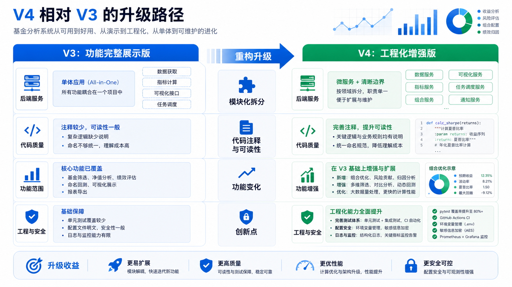

# 基金收益预测助手 V4


基金收益预测助手 V4 是一个面向个人投资者的本地化基金分析平台，提供基金持仓管理、实时估值、组合分析、基金对比、定投回测、市场情绪、AI 晨报、数据导出和 AI 投资助手等功能。项目采用 Flask 后端、原生 JavaScript 前端和多源金融数据接口，重点放在可本地运行、可扩展、可解释的基金投资辅助分析。

> 免责声明：本项目仅用于学习、研究和个人投资辅助分析，不构成任何投资建议。基金、股票、贵金属等金融资产存在风险，实际投资决策请自行判断并承担风险。

## 版本说明

当前发布版本：V4

V4 是在 V3 主分支基础上的工程化升级版本。V3 已经完成了项目图文文档、组合分析、市场情绪、定投回测、基金对比和测试补齐；V4 的重点不是简单增加页面，而是继续拆细模块边界、增强持仓持久化能力、重构高复杂度前端模块、沉淀市场情绪子服务，并把公开仓库配置调整为更安全的发布形态。

## V4 相对 V3 的核心更新



上图用于快速说明 V4 的升级方向；涉及文件、模块和能力边界的精确说明以表格和后续章节为准。

| 维度 | V3 状态 | V4 更新 |
| --- | --- | --- |
| 版本定位 | V3 是主分支展示版，强调图文文档、项目结构和功能完整度 | V4 作为当前 `main` 主分支，强调模块化落地、持久化能力、服务拆分和安全发布 |
| 模块化拆分 | 已有 `routes / services / quant / static/js` 分层，但部分 service 和前端文件仍偏大 | 拆出 `services/recommend/`、`services/sentiment/`、`static/js/portfolio/`、`static/js/fund-compare/`、`static/js/backtest/`、`static/js/sentiment/` 等子模块 |
| 持仓能力 | 以浏览器本地持仓和组合分析为主 | 新增 `holding_routes.py`、`holding_store.py`，为后端持仓持久化和 MySQL 存储打基础 |
| 导入能力 | 已支持文本/图片导入思路，逻辑较集中 | 新增 `import_service.py`，把导入解析从路由中下沉到服务层 |
| 推荐引擎 | 推荐逻辑主要集中在 `recommend_service.py` | 新增 `recommend/pool.py` 和 `recommend/scoring.py`，拆分候选池获取、快速评分和综合评分 |
| 市场情绪 | `sentiment_service.py` 承担较多职责 | 拆分为 `sentiment/market.py`、`limits.py`、`limit_store.py`、`etf.py`、`etf_store.py`、`volume.py`、`scheduler.py` 等模块 |
| 前端结构 | 基金对比、组合分析、定投回测、市场情绪的主文件体积较大 | 按功能拆成 API、状态、图表、样式、事件、详情、结果等模块，入口文件变薄 |
| 代码注释 | V3 已补充模块级说明和关键流程注释 | V4 保留关键注释，同时让文件职责更单一，减少“靠注释解释大文件”的维护压力 |
| 测试覆盖 | V3 有组合分析和板块服务测试 | V4 新增市场情绪字段解析、北向资金汇总、fallback 行为测试，当前基础测试 88 个通过 |
| 配置安全 | V3 已开始使用 `.env.example` 和非敏感配置 | V4 从 Git 跟踪中移除 `src/config.json`，新增 `src/config.example.json`，真实密钥只留在本地或环境变量 |

## 模块化拆分升级


V4 的主要工程变化是把 V3 中“已经分层但仍然偏集中”的模块继续拆细。拆分目标不是为了增加目录数量，而是让每个文件有更清楚的职责边界，便于测试、维护和继续扩展。

### 后端服务拆分

- `src/services/recommend_service.py` 不再承载完整推荐流程细节，候选池和评分逻辑拆入 `src/services/recommend/`。
- `src/services/sentiment_service.py` 从单一大服务拆成市场概览、涨跌停、ETF、成交量、后台刷新和通用缓存等子模块。
- `src/services/import_service.py` 独立处理持仓导入解析，路由层只负责请求校验和响应封装。
- `src/services/holding_store.py` 独立处理持仓存储，为 Web 持仓、本地持仓和 MySQL 持久化提供统一入口。
- `src/routes/holding_routes.py` 新增持仓 API，避免持仓逻辑继续散落在基金路由或前端本地状态中。

### 前端模块拆分

V3 的几个前端核心文件已经能完成业务功能，但文件较大。V4 将它们拆成可读性更高的子模块：

| V3 大文件 | V4 拆分方向 |
| --- | --- |
| `portfolio-analysis.js` | `portfolio/api.js`、`allocation.js`、`charts.js`、`details.js`、`events.js`、`risk.js`、`state.js`、`styles.js` |
| `fund-compare.js` | `fund-compare/api.js`、`chart.js`、`events.js`、`signal-modal.js`、`state.js`、`styles.js`、`view.js` |
| `backtest.js` | `backtest/api.js`、`charts.js`、`config.js`、`form.js`、`results.js`、`styles.js` |
| `sentiment.js` | `sentiment/api.js`、`charts.js`、`details.js`、`etf.js`、`limit-stocks.js`、`overview.js`、`state.js`、`styles.js` |

拆分后，入口文件更像“装配层”，具体 UI 渲染、API 调用、图表绘制、事件绑定和状态管理分别放在对应模块中，后续改某个子功能时不需要反复穿梭于一个超长文件。

## 代码注释与可读性变化

V3 的注释重点是“解释项目是什么、模块负责什么”。V4 的可读性提升更多来自结构本身：

- 保留核心模块 docstring 和关键算法注释，例如推荐评分、市场情绪解析、组合风险评估。
- 对复杂业务采用“拆模块 + 命名表达意图”的方式，减少在大文件中堆叠长注释。
- 路由层更薄，接口文件主要体现 API 输入输出；业务细节放入 service，便于单独阅读和测试。
- 前端模块按视图和职责命名，例如 `risk.js` 负责风险指标，`allocation.js` 负责资产与板块配置，`signal-modal.js` 负责基金信号弹窗。
- 配置文件注释更新为真实优先级：环境变量、本地 `config.json`、公开模板、代码默认值。

## 功能变化与创新点


V4 在功能层面延续 V3 的基金分析平台定位，但新增和强化了几个更适合实际使用的能力：

1. **后端持仓持久化能力**
   - V3 更偏浏览器本地持仓和前端组合分析。
   - V4 新增持仓路由和存储服务，为跨设备、服务端保存、MySQL 落库打基础。

2. **市场情绪服务细化**
   - V3 已有市场情绪入口。
   - V4 将涨跌停、ETF 情绪、成交量、市场概览、缓存和后台刷新拆成独立模块，后续可以单独扩展每类情绪指标。

3. **ETF 与涨跌停数据增强**
   - 新增 ETF 相关数据存储与连续状态分析模块。
   - 新增涨跌停数据存储和 fallback 测试，让市场情绪不只依赖单一实时接口。

4. **推荐引擎结构升级**
   - 候选池获取、快速评分、综合评分拆开后，推荐逻辑更容易调整。
   - 后续可以独立替换基金池来源、评分权重或风控指标。

5. **前端分析体验增强**
   - 组合分析、基金对比、定投回测、市场情绪都从“大文件实现”升级为模块化功能组。
   - 图表、详情、样式、事件和 API 分离后，更适合继续增加新指标和新交互。

6. **安全发布**
   - V4 删除被 Git 跟踪的 `src/config.json`。
   - 公开仓库只保留 `src/config.example.json`，真实 AI Key、数据库密码和本地持仓数据不进入提交。

7. **测试补强**
   - 新增 `tests/test_sentiment_market.py`。
   - 覆盖北向资金解析、成交额汇总和主备数据 fallback，降低外部接口字段变化带来的维护风险。

## V4 当前项目介绍

基金收益预测助手 V4 是一个面向个人投资者的本地化基金分析平台，提供基金持仓管理、实时估值、组合分析、基金对比、定投回测、市场情绪、AI 晨报、数据导出和 AI 投资助手等功能。项目采用 Flask 后端、原生 JavaScript 前端和多源金融数据接口，重点放在可本地运行、可扩展、可解释的基金投资辅助分析。

公开仓库只提交 `src/config.example.json`，真实密钥、数据库密码和本地持仓数据通过本地 `src/config.json` 或环境变量维护，避免把敏感信息写入 Git 历史。

## 核心能力

### 1. 基金持仓与实时估值

- 支持添加、删除和展示基金持仓。
- 根据基金代码获取基金名称、净值、估值和涨跌幅。
- 汇总预估总资产、今日预估收益、累计收益、持仓数量和收益率。
- 支持批量导入持仓文本，便于从其他平台迁移数据。

### 2. 组合分析

- 计算组合总资产、总成本、收益和收益率。
- 分析基金类型、重仓股票、板块分布和行业集中度。
- 提供多样化评分、板块集中风险提示和基金回撤信息。
- 帮助用户判断组合是否过度集中在消费、医药、新能源、科技、金融等主题。

### 3. 基金对比

- 支持多基金横向比较。
- 结合净值走势、阶段收益、回撤和信号信息进行对比。
- 前端使用 Chart.js 呈现趋势图和对比图。

### 4. 定投回测

- 支持按基金历史净值模拟定投。
- 评估不同定投周期、金额和时间窗口下的收益表现。
- 用于复盘长期投入策略，而不是只看单日估值。

### 5. 市场情绪

- 跟踪大盘指数、涨跌停、成交、北向资金等市场情绪指标。
- 将市场温度和个基表现结合，辅助判断风险偏好变化。
- 相关逻辑位于 `src/services/sentiment/` 和 `src/routes/sentiment_routes.py`。

### 6. AI 晨报与 AI 助手

- 支持 OpenAI 兼容接口，模型名称和接口地址可配置。
- 提供 AI 晨报、聊天问答和图片识别能力。
- 可通过环境变量覆盖配置：`AI_BASE_URL`、`AI_API_KEY`、`AI_MODEL`。

### 7. 数据导出

- 提供持仓、分析结果或其他业务数据导出能力。
- 便于进一步在 Excel、报表或其他分析工具中使用。

### 8. CLI 命令行

除 Web 页面外，项目还提供 `src/cli.py`：

- `list`：查看本地持仓。
- `add`：添加基金。
- `remove`：删除基金。
- `signal`：查看单只基金多因子信号。
- `recommend`：获取推荐候选。
- `metals`：查看贵金属行情。
- `config`：查看当前配置。

## 技术架构


```text
浏览器 / CLI
    |
    v
Flask 应用入口 src/app.py
    |
    +-- routes/       API 路由层，按基金、市场、AI、组合、回测、情绪等领域拆分
    +-- services/     业务服务层，封装数据获取、缓存、推荐、组合和情绪逻辑
    +-- quant/        量化信号计算
    +-- templates/    单页应用 HTML
    +-- static/       CSS 和 JavaScript 前端资源
```

## 目录结构

```text
.
|-- README.md
|-- docs/
|   |-- PRODUCT.md
|   |-- PROJECT_DIAGRAMS.md
|   |-- PROJECT_DIAGRAMS.drawio
|   `-- images/
|-- src/
|   |-- app.py
|   |-- cli.py
|   |-- cache.py
|   |-- config.py
|   |-- config.example.json
|   |-- ratelimit.py
|   |-- requirements.txt
|   |-- routes/
|   |-- services/
|   |-- quant/
|   |-- static/
|   |-- templates/
|   `-- tests/
`-- skills-lock.json
```

## 环境要求

- Python 3.10 或更高版本。
- Windows、macOS 或 Linux 均可运行。
- 可访问东方财富、新浪财经等外部数据源。
- 如需 AI 功能，需要一个 OpenAI 兼容接口和 API Key。
- 如需 MySQL 持仓持久化能力，需要可用的 MySQL 服务。

## 快速开始

### 1. 克隆仓库

```bash
git clone git@github.com:ningwangyu/turbo-umbrella.git
cd turbo-umbrella
```

### 2. 创建虚拟环境

Windows PowerShell：

```powershell
cd src
python -m venv .venv
.\.venv\Scripts\Activate.ps1
pip install -r requirements.txt
```

macOS / Linux：

```bash
cd src
python -m venv .venv
source .venv/bin/activate
pip install -r requirements.txt
```

### 3. 创建本地配置

复制配置模板：

```bash
cp config.example.json config.json
```

Windows PowerShell：

```powershell
Copy-Item config.example.json config.json
```

然后按需修改 `config.json` 中的 AI 接口、数据库和服务端口。公开仓库不会提交 `config.json`。

也可以用环境变量覆盖 AI 配置：

```bash
export AI_BASE_URL="http://localhost:7361"
export AI_API_KEY="your-api-key"
export AI_MODEL="gpt-5.5"
```

Windows PowerShell：

```powershell
$env:AI_BASE_URL="http://localhost:7361"
$env:AI_API_KEY="your-api-key"
$env:AI_MODEL="gpt-5.5"
```

### 4. 启动 Web 应用

```bash
python app.py
```

浏览器访问：

```text
http://localhost:5000
```

Windows 用户也可以运行：

```powershell
.\start.bat
```

## CLI 使用

所有 CLI 命令都在 `src` 目录下执行：

```bash
python cli.py list
python cli.py add 000001 --value 10000 --profit 500
python cli.py remove 000001
python cli.py signal 000001
python cli.py recommend
python cli.py metals
python cli.py config
```

## 配置说明

`src/config.example.json` 是可提交的配置模板，`src/config.json` 是本地私密配置。

重要配置项：

| 配置路径 | 说明 |
| --- | --- |
| `ai.base_url` | OpenAI 兼容 API 地址 |
| `ai.api_key` | AI 服务密钥，建议通过环境变量传入 |
| `ai.model` | AI 模型名称 |
| `api.eastmoney.*` | 东方财富接口配置 |
| `api.sina.*` | 新浪财经接口配置 |
| `cache.*` | 各类数据缓存时间 |
| `database.mysql.*` | MySQL 连接配置 |
| `recommend.*` | 推荐池规模、并发数和超时时间 |
| `server.host` / `server.port` | Flask 服务监听地址和端口 |

## API 概览

常用接口包括：

| 接口 | 方法 | 说明 |
| --- | --- | --- |
| `/api/fund/<code>` | GET | 获取单只基金估值 |
| `/api/fund/batch` | POST | 批量获取基金数据 |
| `/api/fund/search` | GET | 基金搜索 |
| `/api/fund/holdings/<code>` | GET | 获取基金重仓股 |
| `/api/fund/performance/<code>` | GET | 获取历史走势 |
| `/api/fund/signal/<code>` | GET | 获取多因子买卖信号 |
| `/api/fund/recommend` | GET | 获取基金推荐 |
| `/api/portfolio/stats` | POST | 获取组合统计 |
| `/api/portfolio/analysis` | POST | 获取组合分析 |
| `/api/market/index` | GET | 获取市场指数 |
| `/api/market/sectors` | GET | 获取热门板块 |
| `/api/sentiment/*` | GET | 获取市场情绪相关数据 |
| `/api/ai/chat` | POST | AI 对话 |
| `/api/ai/recognize-image` | POST | 图片识别 |
| `/api/export/*` | GET/POST | 数据导出 |

实际接口以 `src/routes/` 中的路由定义为准。

## 测试

在 `src` 目录运行：

```bash
pytest
```

当前测试覆盖组合分析、板块分类和部分市场情绪逻辑。涉及外部行情接口的功能建议通过 mock 或测试环境数据验证，避免测试结果受网络波动影响。

## 部署建议

### 本地部署

适合个人使用：

```bash
cd src
python app.py
```

### 服务器部署

生产环境建议：

- 使用 Gunicorn、uWSGI 或 Waitress 承载 Flask 应用。
- 使用 Nginx 做反向代理。
- 将 `AI_API_KEY`、数据库密码等敏感信息放到环境变量或服务器私密配置中。
- 关闭 Flask debug 模式。
- 对外开放前增加身份认证或访问控制。

## 安全注意事项

- 不要提交 `src/config.json`、`.env`、数据库文件和本地持仓文件。
- AI Key、数据库密码和代理地址应通过环境变量或私密配置管理。
- 本项目会调用第三方金融数据源，接口可用性和返回格式可能变化。
- 如果仓库曾经提交过真实密钥，应立即吊销旧密钥并重新生成。

## 分支策略

当前 V4 版本作为主分支 `main` 发布。历史版本分支可继续保留，例如：

- `umbrella-v1`
- `umbrella-v2`

发布新版本时建议按以下方式操作：

```bash
git checkout main
git pull --rebase origin main
git checkout -b umbrella-v4
git push -u origin umbrella-v4
```

确认无误后再合并回 `main`，避免覆盖远端已有历史。

## 维护建议


- 新功能按路由、服务、前端模块分别拆分，保持 `routes/` 只处理请求和响应。
- 外部 API 调用统一放在 `services/`，并加缓存、超时和容错。
- 复杂计算放在 `quant/` 或独立 service 中，便于测试。
- 前端大型功能继续按 `src/static/js/<feature>/` 模块化拆分。
- 涉及金融数据的逻辑必须保留异常兜底，避免单个数据源失败导致页面整体不可用。
