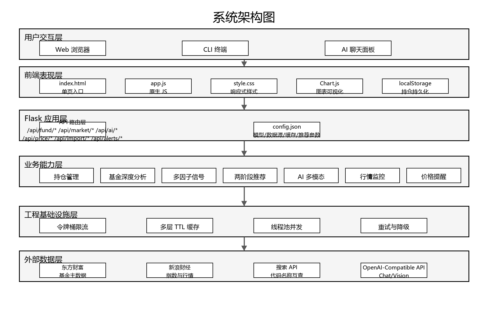
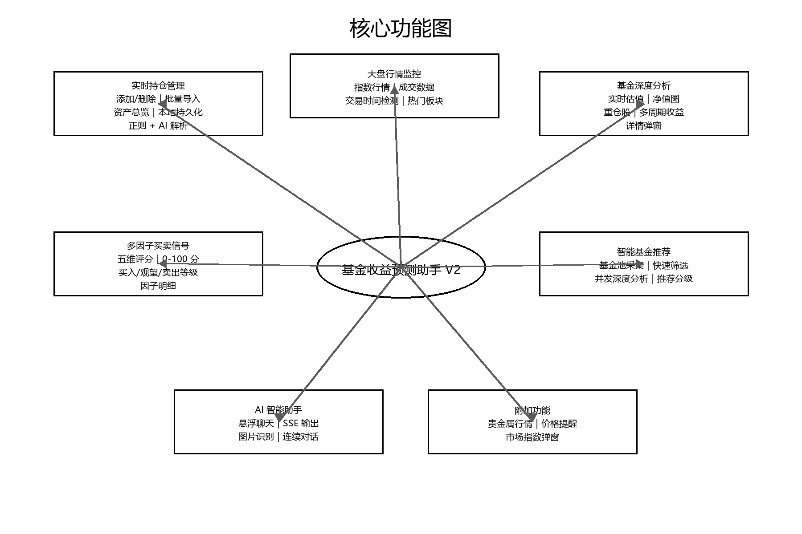
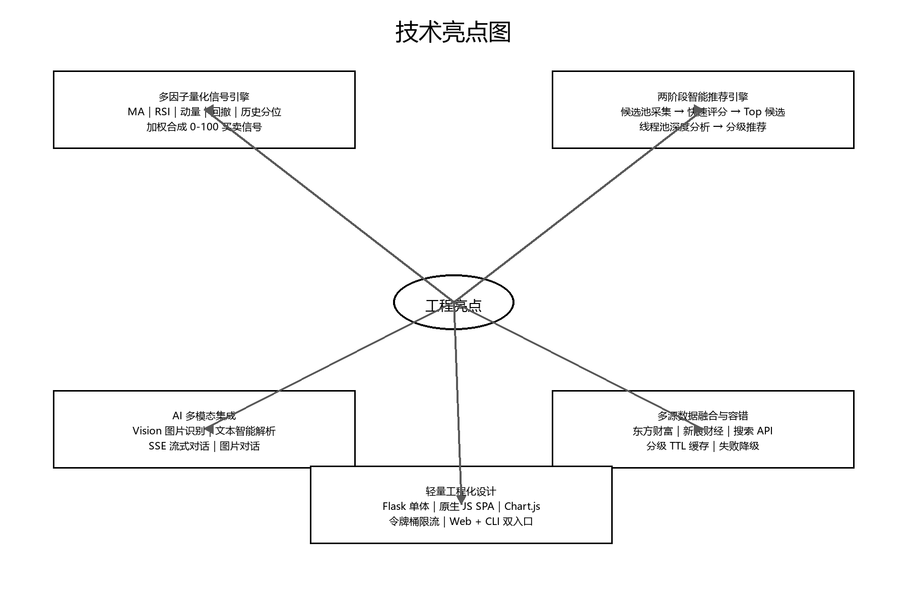

# 基金收益预测助手 V3

基金收益预测助手 V3 是在 V2 模块化版本基础上的继续升级。V2 已经完成了从单体项目到 `routes / services / quant` 分层架构的重构，并补齐组合分析、定投回测、市场情绪、数据导出和 AI 晨报等能力；V3 的重点是在既有模块化基础上继续细化模块边界、强化代码注释与可读性、扩展分析功能、补齐测试与图文文档，让项目更适合作为完整的软件工程项目展示和后续二次开发基础。

> 说明：本项目仅用于学习、研究和辅助分析，不构成任何投资建议。基金和市场数据来自第三方接口，实际交易前请以官方渠道为准。



上图展示 V3 的整体工程结构：用户从 Web、CLI 和 AI 面板进入系统，后端通过 Flask Blueprint 组织接口，业务能力下沉到 services 与 quant 模块，并通过缓存、限流和重试机制对接外部金融数据源与 AI 服务。

## V3 相对 V2 的核心更新

| 维度 | V2 | V3 更新 |
| --- | --- | --- |
| 模块化拆分 | 已完成 `routes/`、`services/`、`quant/` 基础分层 | 继续细化业务模块，新增 `sector_service.py`，强化组合、情绪、回测、基金对比等独立前端模块 |
| 后端职责 | 已有 9 个 Blueprint，基础接口较完整 | 强化 `portfolio_routes.py`、`sentiment_routes.py`、`fund_service.py`、`sentiment_service.py` 等核心模块，提升分析维度和接口组织 |
| 前端模块 | 已按 AI、行情、回测、组合、推荐、情绪等拆分 | 大幅增强 `portfolio-analysis.js`、`sentiment.js`、`fund-compare.js`、`backtest.js`，让分析、对比和回测从接口能力变成更完整的交互能力 |
| 代码注释 | 已有模块级说明和关键流程注释 | 继续补充入口、配置、服务、路由、回测、情绪和组合分析的说明，使源码更适合阅读、答辩和二次开发 |
| 功能范围 | 已具备基金分析、组合统计、回测、情绪、导出、晨报 | 强化市场情绪、板块分析、基金对比、组合分析、定投回测明细和前端展示完整度 |
| 配置安全 | V2 使用 `config.example.json` 和本地 `config.json` 思路 | V3 提供 `.env.example`，仓库内 `src/config.json` 仅保留空占位，AI 地址、密钥和模型优先从环境变量读取 |
| 测试质量 | 以功能实现和项目展示为主 | 新增 `tests/test_portfolio_routes.py`、`tests/test_sector_service.py`，当前基础测试 81 个通过 |
| 文档材料 | README 和 API 文档为主 | 新增 V3 README 升级对比、`docs/PRODUCT.md`、项目图示、Draw.io 源文件和架构/功能/技术亮点图片 |



V3 文档不再只列文字功能点，而是用功能图把持仓管理、行情监控、基金分析、量化信号、智能推荐、AI 助手和扩展能力放在一张图里，便于快速理解项目边界。

## 模块化拆分说明

V2 已经完成了基础模块化拆分，V3 的重点是让模块边界更清楚、业务能力更集中，避免“有分层但细节仍然混在一起”。当前结构更适合维护、展示和继续扩展：

- `src/app.py`：Flask 应用入口，只负责创建应用、启用 CORS、配置限流和注册 Blueprint。
- `src/routes/`：API 路由层，按基金、行情、AI、提醒、组合、回测、情绪、导出、晨报拆分。
- `src/services/`：业务服务层，集中处理基金数据、市场数据、板块数据、AI 调用、推荐、情绪、回测和晨报逻辑。
- `src/quant/signals.py`：量化信号计算层，封装 MA、RSI、动量、回撤和历史分位等因子。
- `src/cache.py`：通用 TTL 缓存，降低外部行情接口压力。
- `src/ratelimit.py`：令牌桶限流器，保护东方财富、新浪财经等外部数据源。
- `src/services/sector_service.py`：V3 新增板块服务模块，独立沉淀板块和市场温度相关逻辑。
- `src/static/js/`：前端交互继续按场景拆分，重点强化基金对比、组合分析、市场情绪和定投回测。
- `src/static/css/`：样式按基础、布局、组件、弹窗、AI 聊天、基金卡片和响应式布局拆分。



技术亮点图对应 V3 的实现重点：多因子信号、两阶段推荐、AI 多模态、多源数据融合、分级缓存、接口限流、Web 与 CLI 双入口。

## 代码注释和可读性升级

V2 已经开始补充注释，V3 进一步把“为什么这样设计”和“模块负责什么”写进源码与文档。主要改进包括：

- 每个核心 Python 模块增加模块级说明，描述职责、输入输出和容错策略。
- 路由文件按业务域命名，接口路径和 Blueprint 对应关系更直观。
- CLI 命令保留函数级注释，说明每个命令复用的后端逻辑。
- 量化信号、推荐引擎、AI 服务、缓存、限流器、情绪指标和回测逻辑保留关键实现注释，便于理解算法和工程权衡。
- README 和 docs 文档补充 V3 对 V2 的升级说明、项目结构、配置、安全注意事项、产品介绍和图示材料。

## 功能变化与创新点

V2 已经具备“基金分析 + 组合分析 + 回测 + 情绪 + AI”的完整框架。V3 的变化集中在把这些能力做深、做清楚，并补齐更适合展示的工程材料：

1. **组合分析增强**
   - V3 大幅强化 `portfolio-analysis.js` 和 `portfolio_routes.py`。
   - 组合分析从基础统计扩展到更完整的结构分析、收益拆解、风险提示和前端展示。

2. **定投回测**
   - 在 V2 已有回测能力基础上，继续完善 `backtest.js` 与 `backtest_service.py`。
   - 强化定投结果、明细展示、策略对比和交互体验。

3. **市场情绪指标**
   - 强化 `sentiment_service.py`、`sentiment_routes.py` 和 `sentiment.js`。
   - 市场情绪从接口能力升级为更完整的前后端分析模块，覆盖涨跌分布、成交趋势、ETF 表现等市场温度信息。

4. **数据导出**
   - 保留 V2 的 JSON / CSV 导出能力。
   - 与 V3 更完整的组合分析和前端状态结合，便于把分析结果迁移到表格、报告或其他系统。

5. **AI 晨报**
   - 保留 V2 的晨报服务与 `/api/report/morning` 接口。
   - 在 V3 文档中把晨报作为“行情、持仓、AI 总结”结合的复盘能力单独说明。

6. **基金对比**
   - V3 明显扩展 `fund-compare.js` 和相关基金数据服务。
   - 支持从多个基金维度横向比较，而不是只查看单只基金详情。

7. **板块服务独立化**
   - V3 新增 `sector_service.py` 和对应测试。
   - 板块与市场温度逻辑从通用服务中拆出，职责更集中，也便于单独验证。

8. **测试补齐**
   - 新增组合路由和板块服务测试。
   - 当前基础测试覆盖 81 个用例，提升后续继续改造时的稳定性。

9. **配置与密钥安全**
   - V3 把仓库内配置改为非敏感占位值。
   - AI 服务地址、密钥和模型通过环境变量覆盖，降低公开上传风险。

10. **文档和展示材料升级**
   - 新增 `docs/PRODUCT.md`、`docs/PROJECT_DIAGRAMS.md`、Draw.io 源文件和项目图示图片。
   - 文档从单纯使用说明升级为“版本升级说明 + 产品介绍 + 架构图 + 使用说明”的完整展示材料。

## 图文材料索引

| 图文材料 | 文件 | 用途 |
| --- | --- | --- |
| 系统架构图 | `docs/images/architecture.png` | 展示 V3 的前端、后端、服务层、基础设施和外部数据源关系 |
| 核心功能图 | `docs/images/core_functions.png` | 展示 V3 的功能模块和用户可感知能力 |
| 技术亮点图 | `docs/images/technical_highlights.png` | 展示量化、推荐、AI、多源数据和工程化设计亮点 |
| 项目图示说明 | `docs/PROJECT_DIAGRAMS.md` | 保存 Mermaid 图示源码，方便论文、汇报和二次编辑 |
| Draw.io 源文件 | `docs/PROJECT_DIAGRAMS.drawio` | 可在 draw.io / diagrams.net 中继续修改 |
| 产品介绍文档 | `docs/PRODUCT.md` | 更完整的图文产品说明和技术说明 |

## 项目定位

- **版本**：V3
- **主分支**：`main`
- **上一版分支**：`umbrella-v2`
- **历史版本**：`umbrella-v1`
- **后端**：Python Flask
- **前端**：原生 HTML / CSS / JavaScript
- **图表**：Chart.js
- **AI 接口**：OpenAI 兼容 Chat Completions / Vision API
- **数据源**：东方财富、天天基金、新浪财经等公开行情接口

## V3 功能概览

1. **基金持仓管理**
   - 添加、删除和查看基金持仓。
   - 自动补全基金名称和实时估值。
   - 本地浏览器持久化持仓数据。
   - 支持文本导入和图片识别导入持仓。

2. **实时行情看板**
   - 展示上证指数、深证成指、创业板指等主要市场指数。
   - 展示热门行业板块、涨跌幅、成交额和领涨标的。
   - 支持交易时间状态识别。

3. **基金深度分析**
   - 查询基金实时估值、历史净值、阶段收益和重仓股。
   - 使用图表展示净值走势。
   - 支持单只基金详情弹窗查看。

4. **多因子量化信号**
   - 使用 MA 均线、RSI、近期动量、回撤幅度和历史分位等因子生成买卖评分。
   - 输出强烈建议买入、建议买入、观望、建议卖出、强烈建议卖出等信号。

5. **智能基金推荐**
   - 先从基金排行榜中构建候选池。
   - 再进行收益能力、风险控制、夏普比率、收益一致性和技术面分析。
   - 使用并发任务提升推荐分析速度。

6. **AI 智能助手**
   - 支持中文基金投资问答。
   - 支持 SSE 流式输出。
   - 支持上传截图识别持仓内容。
   - 使用 OpenAI 兼容接口，便于替换不同模型服务。

7. **扩展工具**
   - 贵金属价格和走势。
   - 价格提醒。
   - 定投回测。
   - 市场情绪指标。
   - 持仓分析和数据导出。
   - CLI 命令行工具。

## 目录结构

```text
jijinv3/
├── README.md
├── .env.example
├── docs/
│   ├── PRODUCT.md
│   ├── PROJECT_DIAGRAMS.md
│   └── images/
├── src/
│   ├── app.py                  # Flask 应用入口
│   ├── cli.py                  # 命令行工具
│   ├── config.py               # 配置加载和全局常量
│   ├── config.json             # 非敏感默认配置
│   ├── cache.py                # TTL 缓存
│   ├── ratelimit.py            # API 限流器
│   ├── requirements.txt        # Python 依赖
│   ├── start.bat               # Windows 一键启动脚本
│   ├── quant/
│   │   └── signals.py          # 多因子信号引擎
│   ├── routes/                 # Flask Blueprints
│   ├── services/               # 业务服务层
│   ├── static/                 # CSS / JavaScript 静态资源
│   ├── templates/
│   │   └── index.html          # 单页应用入口
│   └── tests/                  # 测试用例
└── skills-lock.json
```

## 快速开始

### 1. 克隆项目

```bash
git clone git@github.com:ningwangyu/turbo-umbrella.git
cd turbo-umbrella
```

### 2. 创建虚拟环境

Windows PowerShell：

```powershell
cd src
python -m venv .venv
.\.venv\Scripts\Activate.ps1
pip install -r requirements.txt
```

macOS / Linux：

```bash
cd src
python3 -m venv .venv
source .venv/bin/activate
pip install -r requirements.txt
```

### 3. 配置 AI 服务

AI 功能不是启动项目的硬性要求；如需使用 AI 对话和图片识别，请设置 OpenAI 兼容服务参数。

Windows PowerShell：

```powershell
$env:AI_BASE_URL="https://your-openai-compatible-endpoint"
$env:AI_API_KEY="your-api-key"
$env:AI_MODEL="gpt-5.5"
```

macOS / Linux：

```bash
export AI_BASE_URL="https://your-openai-compatible-endpoint"
export AI_API_KEY="your-api-key"
export AI_MODEL="gpt-5.5"
```

也可以参考 `.env.example` 管理本地环境变量。AI API 的 URL 和 Key 分别对应 `AI_BASE_URL`、`AI_API_KEY`，可在 `.env` 或运行环境中修改。请不要把真实 API Key 提交到仓库。

### 4. 启动 Web 服务

```bash
python app.py
```

浏览器访问：

```text
http://localhost:5000
```

Windows 用户也可以双击或运行：

```bat
start.bat
```

## CLI 使用

在 `src` 目录下执行：

```bash
python cli.py list
python cli.py add 000001 10000 --profit 120
python cli.py remove 000001
python cli.py signal 000001
python cli.py recommend --count 10
python cli.py metals
python cli.py config
```

常用命令说明：

| 命令 | 用途 |
| --- | --- |
| `list` / `ls` | 查看本地持仓 |
| `add <code> [value]` | 添加基金持仓 |
| `remove <code>` / `rm <code>` | 删除基金持仓 |
| `signal <code>` | 查看单只基金买卖信号 |
| `recommend` / `rec` | 获取推荐基金列表 |
| `metals` | 查看黄金、白银等贵金属行情 |
| `config` | 查看当前配置 |

## 主要 API

| 接口 | 方法 | 说明 |
| --- | --- | --- |
| `/api/fund/<code>` | GET | 获取基金实时估值 |
| `/api/fund/batch` | POST | 批量获取基金数据 |
| `/api/fund/search?q=` | GET | 搜索基金代码或名称 |
| `/api/fund/holdings/<code>` | GET | 获取基金重仓股 |
| `/api/fund/performance/<code>` | GET | 获取基金历史净值走势 |
| `/api/fund/signal/<code>` | GET | 获取量化买卖信号 |
| `/api/fund/recommend` | GET | 获取智能推荐基金 |
| `/api/import/text` | POST | 文本导入持仓 |
| `/api/import/image` | POST | 图片识别导入持仓 |
| `/api/ai/chat` | POST | AI 流式对话 |
| `/api/ai/recognize-image` | POST | AI 图片识别 |
| `/api/market/index` | GET | 获取主要市场指数 |
| `/api/market/sectors` | GET | 获取热门板块 |
| `/api/market/sentiment` | GET | 获取市场情绪 |
| `/api/price/metals` | GET | 获取贵金属价格 |
| `/api/price/metals/trend` | GET | 获取贵金属走势 |
| `/api/alerts` | GET / POST | 管理价格提醒 |
| `/api/alerts/<id>` | DELETE | 删除提醒 |
| `/api/alerts/check` | GET | 检查提醒触发状态 |
| `/api/backtest` | POST | 定投回测 |
| `/api/portfolio/stats` | POST | 持仓统计 |
| `/api/portfolio/analysis` | POST | 持仓分析 |
| `/api/export/json` | POST | 导出 JSON |
| `/api/export/csv` | POST | 导出 CSV |
| `/api/report/morning` | POST | 生成晨报 |

## 配置说明

`src/config.json` 保存非敏感默认配置。敏感配置请通过环境变量注入。需要更换 AI API URL 或 Key 时，修改 `.env` / 运行环境中的 `AI_BASE_URL` 和 `AI_API_KEY`；如只做本地占位，也可以同步调整 `src/config.json` 中的 `ai.base_url` 和 `ai.api_key`。

| 配置项 | 说明 | 默认值 |
| --- | --- | --- |
| `AI_BASE_URL` | OpenAI 兼容 API 地址 | 空 |
| `AI_API_KEY` | AI 服务密钥 | 空 |
| `AI_MODEL` | 模型名称 | `gpt-5.5` |
| `ai.timeout_seconds` | AI 请求超时 | `60` |
| `api.eastmoney.rate_limit_per_second` | 东方财富接口限流 | `5` |
| `api.sina.rate_limit_per_second` | 新浪接口限流 | `3` |
| `cache.estimation_ttl_seconds` | 基金估值缓存秒数 | `30` |
| `cache.performance_ttl_seconds` | 历史走势缓存秒数 | `300` |
| `cache.holdings_ttl_seconds` | 重仓股缓存秒数 | `300` |
| `cache.metals_ttl_seconds` | 贵金属缓存秒数 | `60` |
| `cache.recommend_ttl_seconds` | 推荐结果缓存秒数 | `600` |
| `recommend.max_workers` | 推荐分析并发数 | `10` |
| `recommend.fetch_timeout_seconds` | 推荐分析超时秒数 | `45` |
| `server.port` | Flask 服务端口 | `5000` |

## 测试

项目包含基础测试用例，可在 `src` 目录下运行：

```bash
pip install pytest
pytest
```

如果测试需要访问外部行情接口，请确保当前网络可以访问东方财富、新浪财经等数据源。

## 开发建议

- 不要提交 `.env`、真实 API Key、浏览器本地持仓数据和 Python 缓存文件。
- 业务逻辑优先放在 `src/services/`，路由层只做参数校验和响应封装。
- 新增金融指标时优先放入 `src/quant/`，避免和接口请求逻辑耦合。
- 新增前端模块时放入 `src/static/js/`，并在 `src/templates/index.html` 中按需引入。

## 部署说明

这是一个轻量级 Flask 项目，适合部署到支持 Python 的云服务器、容器平台或 PaaS。生产环境建议：

- 使用 Gunicorn、uWSGI 或 Waitress 承载 Flask 应用。
- 使用 Nginx 做反向代理。
- 使用环境变量管理 AI 密钥。
- 对外部行情接口增加监控和错误降级。
- 根据实际访问量调整缓存 TTL 和接口限流参数。

## 免责声明

本项目提供的估值、排行、信号和推荐结果仅供技术演示和个人研究。金融市场存在风险，任何投资决策都应结合个人风险承受能力并以官方披露数据为准。
