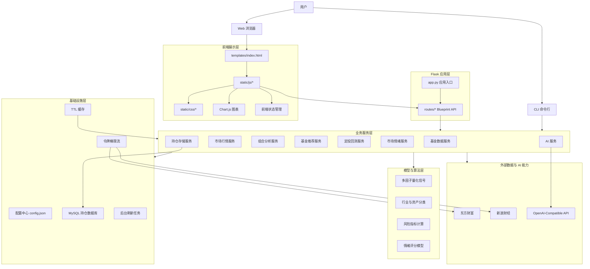
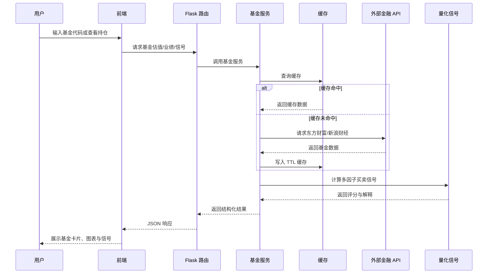
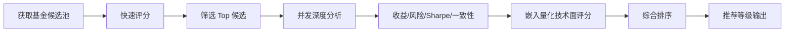
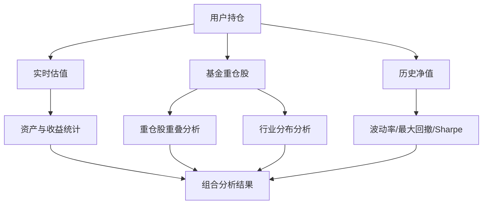
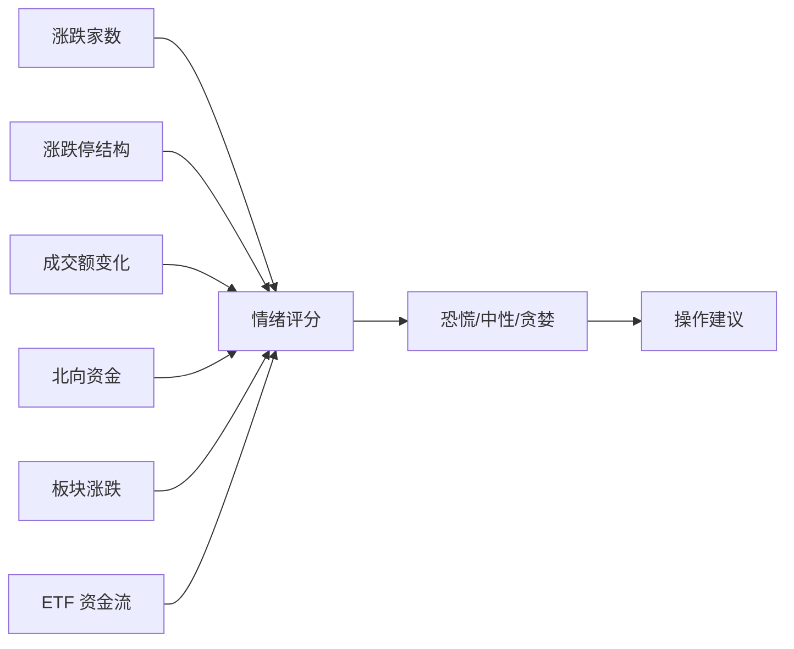

# 基金收益预测助手 V2 项目架构与创新价值说明

## 1. 项目概述

基金收益预测助手 V2 是一套面向个人投资者与基金研究场景的智能化基金分析平台。项目以 Flask 后端服务为核心，结合原生 JavaScript 单页前端、外部金融数据接口、多因子量化模型、市场情绪模型、AI 对话与图片识别能力，构建了从“数据获取、持仓管理、组合分析、量化信号、策略回测、智能推荐”到“AI 晨报生成”的完整投资辅助流程。

项目目标不是简单展示基金净值数据，而是围绕真实投资决策中的核心问题提供一站式支持：

- 当前持仓表现如何？
- 持仓是否过度集中？
- 某只基金是否适合买入、继续持有或卖出？
- 市场整体情绪处于恐慌、平衡还是贪婪状态？
- 定投策略在历史行情中表现如何？
- 哪些基金值得进一步关注？
- 如何快速从截图或文本中导入持仓？

通过这些能力，系统将传统的基金信息查询工具升级为“数据驱动 + 量化模型 + AI 辅助”的综合投资分析平台。

## 2. 总体架构设计

项目采用轻量化、模块化的 Web 架构。后端以 Flask Blueprint 拆分业务接口，服务层承载核心业务逻辑，量化模块负责信号计算，缓存、限流、配置和数据库模块提供基础设施能力。前端采用原生 JavaScript 模块化组织，围绕基金卡片、持仓组合、市场情绪、定投回测、AI 聊天等业务界面进行拆分。



## 3. 项目目录结构

```text
jijin/
├─ docs/                         项目文档与架构说明
│  ├─ PRODUCT.md                 产品说明文档
│  ├─ PROJECT_DIAGRAMS.md        架构图与功能图
│  └─ ARCHITECTURE_AND_INNOVATION.md
│
├─ src/                          项目主体代码
│  ├─ app.py                     Flask 应用入口，注册全部 Blueprint
│  ├─ cli.py                     命令行工具入口，复用服务层能力
│  ├─ config.py                  配置读取与全局常量
│  ├─ config.json                AI、API、缓存、数据库、推荐参数配置
│  ├─ cache.py                   通用 TTL 缓存与业务缓存实例
│  ├─ ratelimit.py               令牌桶限流器，保护外部金融 API
│  ├─ requirements.txt           Python 依赖
│  ├─ start.bat                  Windows 一键启动脚本
│  │
│  ├─ routes/                    API 路由层
│  │  ├─ fund_routes.py          基金估值、搜索、持仓、业绩、信号、导入
│  │  ├─ market_routes.py        大盘指数、热门板块、贵金属行情
│  │  ├─ portfolio_routes.py     持仓统计与组合深度分析
│  │  ├─ sentiment_routes.py     市场情绪、涨跌停、ETF 流向
│  │  ├─ backtest_routes.py      定投策略回测
│  │  ├─ ai_routes.py            AI 聊天与图片识别
│  │  ├─ alert_routes.py         价格提醒
│  │  ├─ export_routes.py        JSON/CSV 数据导出
│  │  ├─ morning_report_routes.py AI 晨报
│  │  └─ holding_routes.py       MySQL 持仓持久化接口
│  │
│  ├─ services/                  业务服务层
│  │  ├─ fund_service.py         基金数据抓取、估值、历史净值、重仓股
│  │  ├─ market_service.py       市场指数、板块、贵金属行情
│  │  ├─ recommend_service.py    推荐入口，组织候选池与深度评分
│  │  ├─ backtest_service.py     普通定投、智能定投、价值平均法回测
│  │  ├─ import_service.py       文本持仓解析与基金名称补全
│  │  ├─ ai_service.py           AI API 调用与流式响应
│  │  ├─ morning_report_service.py 市场与持仓 AI 晨报生成
│  │  ├─ sector_service.py       基金与股票行业分类、分散度评估
│  │  ├─ holding_store.py        MySQL 持仓存储、建表与迁移
│  │  ├─ recommend/              推荐候选池与评分模型
│  │  └─ sentiment/              市场情绪、涨跌停、ETF 流向与后台任务
│  │
│  ├─ quant/
│  │  └─ signals.py              多因子买卖信号引擎
│  │
│  ├─ templates/
│  │  └─ index.html              单页应用入口
│  │
│  ├─ static/
│  │  ├─ css/                    页面、组件、弹窗、响应式样式
│  │  └─ js/                     前端交互模块
│  │     ├─ app.js               主入口
│  │     ├─ fund-card.js         基金卡片
│  │     ├─ recommend.js         推荐展示
│  │     ├─ sentiment/           市场情绪界面
│  │     ├─ portfolio/           组合分析界面
│  │     ├─ backtest/            定投回测界面
│  │     └─ fund-compare/        基金对比界面
│  │
│  └─ tests/                     组合、行业、情绪等测试用例
│
├─ skills/                       辅助技能配置
├─ .agents/                      Agent 配置
└─ .claude/                      开发环境辅助配置
```

## 4. 分层架构说明

### 4.1 用户交互层

用户交互层由 Web 浏览器和 CLI 命令行两类入口构成。

Web 端面向日常使用，提供持仓管理、基金卡片、行情展示、回测图表、AI 聊天、情绪看板等可视化能力。CLI 端主要用于快速查询、调试和命令行场景，复用同一套服务层逻辑，避免业务规则重复实现。

### 4.2 前端展示层

前端采用原生 JavaScript、HTML、CSS 和 Chart.js 实现。系统没有依赖大型前端框架，而是通过业务模块拆分实现轻量化 SPA 体验。

主要特点：

- 以 `index.html` 作为单页应用入口。
- 使用 `static/js` 下的模块组织不同业务功能。
- 通过 Chart.js 展示净值走势、组合风险、回测结果、市场情绪等图表。
- 通过模块化 JS 管理持仓、导入、推荐、AI、行情、情绪等交互。
- 前端保留本地状态，同时支持后端 MySQL 持仓持久化。

### 4.3 Flask 应用层

Flask 应用层负责统一接收 HTTP 请求，并通过 Blueprint 将不同业务领域拆分到独立文件中。该层主要处理参数解析、异常响应和结果封装，不承担复杂业务计算。

这种设计使系统具备清晰的接口边界：

- 基金相关接口集中在 `fund_routes.py`。
- 市场行情接口集中在 `market_routes.py`。
- 组合分析接口集中在 `portfolio_routes.py`。
- AI 能力集中在 `ai_routes.py` 与 `morning_report_routes.py`。
- 回测、情绪、导出、提醒和持仓持久化分别由独立 Blueprint 承担。

### 4.4 业务服务层

服务层是项目的核心业务实现区域。它屏蔽了外部接口差异、缓存策略、数据解析方式和算法调用细节，向路由层提供稳定的函数能力。

关键服务包括：

| 服务模块 | 职责 |
|---|---|
| `fund_service.py` | 获取基金估值、历史净值、收益区间、重仓股、基金搜索 |
| `market_service.py` | 获取大盘指数、热门板块、贵金属行情与走势 |
| `recommend_service.py` | 组织基金候选池，执行推荐排序 |
| `backtest_service.py` | 执行定投策略历史回测 |
| `sector_service.py` | 进行行业分类、资产分类和分散度评估 |
| `holding_store.py` | 提供 MySQL 持仓持久化、自动建表和迁移 |
| `morning_report_service.py` | 整合行情与持仓数据，生成 AI 晨报 |
| `sentiment/*` | 计算市场情绪、涨跌停结构、ETF 连续流入流出 |

### 4.5 模型与算法层

模型与算法层主要包括多因子量化信号、推荐评分、市场情绪评分、组合风险分析、定投策略回测等。

项目中的算法并非单点功能，而是互相复用。例如推荐评分会调用量化信号中的技术面评分，组合分析会调用基金持仓、行业分类和风险指标，AI 晨报会整合行情、板块、贵金属和用户持仓结果。

### 4.6 基础设施层

基础设施层为系统稳定运行提供支撑：

- `config.json`：集中管理 AI、外部 API、缓存 TTL、推荐参数、数据库连接等配置。
- `cache.py`：为基金估值、历史净值、重仓股、推荐结果、情绪数据等提供 TTL 缓存。
- `ratelimit.py`：使用令牌桶算法限制外部 API 请求频率。
- `holding_store.py`：提供数据库自动建表、字段迁移、唯一索引和持仓 Upsert。
- `scheduler.py`：后台刷新市场情绪相关数据，降低前台请求压力。

### 4.7 外部数据与 AI 能力层

项目主要融合三类外部能力：

- 东方财富：基金估值、历史净值、基金排名、重仓股、板块行情、涨跌停数据等。
- 新浪财经：部分场内基金、指数和贵金属行情补充。
- OpenAI-Compatible API：聊天、图片识别、文本理解和 AI 晨报生成。

通过多源数据接入与失败降级机制，系统在部分接口异常时仍能尽量保持核心功能可用。

## 5. 核心业务流程

### 5.1 基金分析流程



### 5.2 智能推荐流程



推荐系统采用两阶段设计：

1. 快速阶段：基于排名数据中的多周期收益进行低成本初筛，避免对全量基金逐一发起高成本详情请求。
2. 深度阶段：对候选基金并发获取详细数据，融合收益能力、风险控制、风险调整收益、收益一致性和技术面信号，形成最终推荐结果。

### 5.3 组合分析流程

组合分析不是简单求和，而是从多个维度评估用户持仓。



输出内容包括：

- 总资产、总成本、累计收益、今日预估收益。
- 单只基金仓位权重。
- 资产大类分布。
- 行业板块暴露。
- 重仓股重复暴露。
- 组合波动率、最大回撤、Sharpe 等风险指标。

### 5.4 市场情绪计算流程



市场情绪模块将多个分散的市场指标统一映射为 0-100 分的情绪指数，帮助用户从整体市场环境理解持仓表现。

## 6. 核心创新点

### 6.1 从“基金查询”升级为“投资决策辅助”

传统基金工具通常只展示净值、涨跌幅、排名和基础资料。本项目将基金数据进一步加工为投资决策所需的信息，包括买卖信号、组合风险、市场情绪、定投回测和 AI 解读，使系统从“信息展示工具”升级为“分析决策工具”。

### 6.2 多因子量化买卖信号引擎

项目内置多因子量化信号模型，从五个维度评价基金当前状态：

| 因子 | 作用 | 投资含义 |
|---|---|---|
| MA 均线位置 | 判断净值相对中短长期趋势的位置 | 识别趋势强弱 |
| RSI 指标 | 判断短期超买或超卖 | 识别过热或过冷 |
| 近期动量 | 观察短期涨跌幅变化 | 捕捉回调或加速 |
| 回撤幅度 | 衡量相对阶段高点的下跌程度 | 判断风险释放程度 |
| 历史分位 | 判断当前净值所处历史位置 | 衡量相对估值水平 |

模型将每个因子标准化为 0-100 分，再加权合成为买入评分，并输出明确的信号等级和解释。这种设计具备较强可解释性，适合普通投资者理解模型依据。

### 6.3 两阶段智能推荐机制

基金数量庞大，如果对所有基金逐一进行深度计算，会导致响应慢、接口压力大、用户体验差。项目采用两阶段推荐机制：

- 第一阶段使用低成本数据快速筛选候选基金。
- 第二阶段只对候选基金做深度分析。

这种方式在性能和准确性之间取得平衡，既能扩大候选范围，又避免无效接口调用。

### 6.4 市场情绪指数模型

项目将涨跌家数、涨跌停、成交额、北向资金、ETF 流向、板块涨跌等指标融合为市场情绪指数。该能力解决了普通投资者只看指数涨跌但无法判断市场内部结构的问题。

例如指数小涨但下跌家数较多，说明市场可能存在分化；指数下跌但 ETF 持续流入，可能说明资金正在逆向布局。情绪模型能为用户提供更完整的市场环境判断。

### 6.5 持仓组合级分析

系统不仅关注单只基金，还从组合层面分析整体风险，包括：

- 资产类别是否过度集中。
- 行业板块是否过度集中。
- 多只基金是否重复持有同一批股票。
- 组合波动率和最大回撤是否可接受。
- 持仓收益和今日预估收益如何变化。

这种设计更贴近真实投资场景。因为投资风险往往不是来自单只基金，而是来自整个组合的隐性集中暴露。

### 6.6 智能定投回测

项目支持普通定投、智能定投和价值平均法三类策略回测。用户可以基于真实历史净值比较不同策略的投入金额、最终市值、收益率、平均成本和最大回撤。

该能力使用户可以在投资前验证策略，而不是只凭主观感受制定定投计划。

### 6.7 AI 多模态能力融入投资流程

AI 能力不是孤立聊天窗口，而是嵌入到实际业务流程中：

- 图片识别：上传持仓截图，自动识别基金代码、名称、金额等信息。
- 文本解析：从自然语言、复制文本或混合格式中提取持仓。
- AI 对话：基于基金投资顾问角色回答问题。
- AI 晨报：整合真实行情和用户持仓，生成简洁投资简报。

这种设计使 AI 成为提升操作效率和解释能力的工具，而不是单纯的内容生成模块。

### 6.8 多源数据融合与容错设计

项目综合使用东方财富、新浪财经和 AI API。对于实时估值、场内基金行情、指数行情、板块数据等不同场景，系统采用主数据源和备用数据源组合，并通过缓存与限流降低外部依赖风险。

主要工程价值包括：

- 减少单一接口失败对系统的影响。
- 降低频繁刷新对外部接口的压力。
- 提升页面响应速度。
- 避免高并发请求导致接口被限制。

### 6.9 轻量化工程架构

系统没有采用过重的微服务或前端框架，而是通过 Flask、Blueprint、服务层、原生 JS 模块化和 Chart.js 形成轻量可维护架构。对于个人投资工具、毕业设计项目或中小型金融分析系统来说，这种技术选型具备较高性价比。

## 7. 项目对外宣传价值

### 7.1 对个人投资者的价值

项目帮助个人投资者从“看净值、看涨跌”转向“看组合、看风险、看信号、看策略”。

用户可以更清楚地了解：

- 今天亏损或盈利来自哪些基金。
- 当前组合是否过于集中。
- 基金是否处于相对高位或低位。
- 市场环境是否适合加仓。
- 定投策略在历史中是否有效。
- AI 对当前行情和持仓有什么简明解释。

这有助于减少情绪化操作，提高投资决策的理性程度。

### 7.2 对基金研究场景的价值

对于基金研究或课程设计场景，项目提供了一套完整的基金分析样例：

- 数据采集：对接真实金融数据接口。
- 数据处理：解析估值、净值、收益、持仓、板块和情绪数据。
- 模型计算：量化信号、推荐评分、风险指标、回测策略。
- 可视化展示：通过图表和卡片呈现分析结果。
- AI 增强：使用大模型进行识别、解释和报告生成。

项目具备较强的展示性和可扩展性，适合作为金融科技、数据分析、软件工程、智能应用开发等方向的综合实践项目。

### 7.3 对工程实践的价值

项目体现了完整的软件工程思路：

- 路由层、服务层、算法层、基础设施层分离。
- 缓存、限流、错误降级等稳定性设计。
- MySQL 自动建表和迁移，降低部署复杂度。
- Web 与 CLI 双入口复用业务逻辑。
- 前端按功能模块拆分，便于维护。
- 测试覆盖部分核心业务模块。

这说明项目不仅关注功能实现，也关注可维护性、可扩展性和运行稳定性。

## 8. 可宣传的项目定位语

### 8.1 一句话介绍

基金收益预测助手 V2 是一款融合实时金融数据、多因子量化模型、组合风险分析、智能回测和 AI 多模态能力的个人基金投资分析平台。

### 8.2 简短宣传文案

本项目面向个人基金投资者，提供从持仓导入、实时估值、组合风险、市场情绪、买卖信号、智能推荐到 AI 晨报的一站式分析能力。系统通过多源金融数据融合、多因子量化评分和 AI 图片识别技术，将复杂的基金研究流程转化为直观、可解释、可操作的投资辅助体验，帮助用户更理性地理解市场和管理持仓。

### 8.3 项目亮点摘要

- 真实金融数据驱动，覆盖基金、指数、板块、贵金属、涨跌停和 ETF 流向。
- 多因子量化信号模型，输出可解释的买入、持有和卖出参考。
- 两阶段智能推荐引擎，兼顾推荐质量和响应性能。
- 组合级风险分析，识别行业集中、重仓股重叠和回撤风险。
- 市场情绪指数，将分散行情指标转化为直观情绪刻度。
- 定投策略回测，支持普通定投、智能定投、价值平均法对比。
- AI 图片识别和晨报生成，提升持仓导入和行情解读效率。
- Flask + 原生 JS 轻量架构，易部署、易维护、易扩展。

## 9. 项目意义

### 9.1 技术意义

项目将 Web 开发、金融数据采集、量化模型、数据可视化、数据库持久化和 AI 能力整合在同一个系统中，展示了一个完整智能金融应用的技术闭环。它不是单一算法演示，而是包含真实数据流、业务流程、用户交互和工程支撑的综合系统。

### 9.2 应用意义

项目解决了个人投资者在基金投资中的常见痛点：

- 信息分散，需要在多个平台之间切换。
- 指标复杂，普通用户难以理解。
- 持仓风险隐藏在多只基金背后。
- 投资决策容易受短期涨跌影响。
- 定投策略缺乏历史验证。

系统通过统一看板、量化评分、风险分析和 AI 解读，为用户提供更清晰的投资参考。

### 9.3 教学与展示意义

从项目展示角度看，本系统具备较强的完整性和层次感。它既有前端可视化界面，又有后端服务架构；既有真实金融数据，又有算法模型；既有传统软件工程能力，又融合了 AI 多模态能力。因此适合用于课程设计、毕业设计、项目答辩、软件竞赛和金融科技应用展示。

## 10. 后续扩展方向

项目后续可以从以下方向继续增强：

- 引入用户账户体系，实现多用户持仓隔离。
- 将 AI 分析与用户风险偏好结合，生成个性化建议。
- 增加更丰富的基金风格分析，如成长、价值、红利、科技、消费等风格暴露。
- 引入更严格的回测评价指标，如年化收益、Calmar、Sortino、胜率等。
- 对推荐模型增加历史验证与参数调优机制。
- 增加定时任务和消息通知，实现市场异常提醒。
- 对敏感配置进行环境变量管理，提高部署安全性。

## 11. 总结

基金收益预测助手 V2 通过模块化 Flask 后端、原生 JavaScript 前端、多源金融数据、量化模型、组合分析、策略回测和 AI 能力，构建了一套面向真实投资场景的智能基金分析系统。

项目的核心价值在于：它将“数据查询”进一步升级为“投资理解与决策辅助”，既关注单只基金的表现，也关注组合层面的风险；既提供客观数据，也提供模型解释；既支持人工操作，也通过 AI 降低导入和分析门槛。整体上，该项目具备明确的应用价值、较完整的工程结构和较突出的金融科技创新特征。
