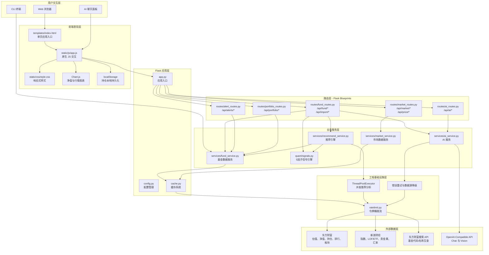
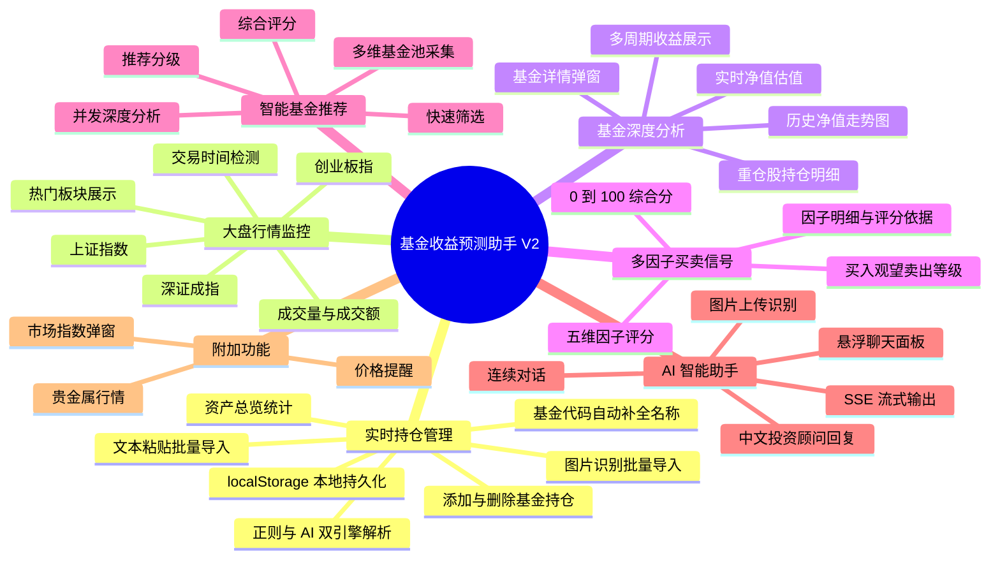

# 基金收益预测助手 V2 项目图示

本文档根据项目根目录 [`PRODUCT.md`](../PRODUCT.md) 及已核对的关键实现文件生成，用于项目说明或论文材料整理。图示采用保守的工程表达，仅包含文档和代码中可证实的模块与能力。

## 一、系统架构图（模块化架构）

依据：`PRODUCT.md` 技术架构、模块化项目结构，以及各模块实现。



## 二、核心功能图

依据：`PRODUCT.md` “核心功能模块”部分。



## 三、技术亮点图

依据：`PRODUCT.md` “技术亮点与创新”部分，并将相关表述整理为可证实的工程亮点。

```mermaid
flowchart LR
    Center[基金收益预测助手 V2\n工程亮点]

    subgraph H1[多因子量化信号引擎]
        MA[MA20/60/120/250\n均线位置]
        RSI[RSI(14)\n超买超卖]
        Momentum[5/10/20 日收益率\n近期动量]
        Drawdown[当前净值相对高点\n回撤幅度]
        Percentile[历史净值百分位\n估值水平]
        SignalScore[加权合成\n0-100 买卖信号]
        MA --> SignalScore
        RSI --> SignalScore
        Momentum --> SignalScore
        Drawdown --> SignalScore
        Percentile --> SignalScore
    end

    subgraph H2[两阶段智能推荐引擎]
        Pool[东方财富排行榜\n候选基金池]
        Quick[快速评分\n收益、一致性、加速度]
        Top[Top 候选进入深度分析]
        Deep[ThreadPoolExecutor\n并发获取详情]
        Rank[收益、风险、夏普、\n一致性、技术面综合评分]
        Level[强烈推荐 / 推荐买入 / 值得关注]
        Pool --> Quick --> Top --> Deep --> Rank --> Level
    end

    subgraph H3[AI 多模态集成]
        VisionImport[Vision API\n图片识别导入]
        TextParse[JSON / 正则 / AI\n文本解析]
        StreamChat[SSE 流式对话\n打字机渲染]
        ImageChat[图片对话\n识别并回答]
    end

    subgraph H4[多源数据融合与容错]
        EM[东方财富\n基金主数据]
        SinaAPI[新浪财经\n指数与补充行情]
        Fallback[搜索 API\n代码名称互查]
        TTL[分级 TTL 缓存]
        Degrade[失败回退与降级]
        EM --> TTL
        SinaAPI --> TTL
        Fallback --> TTL
        TTL --> Degrade
    end

    subgraph H5[轻量工程化设计]
        Flask[Flask 模块化架构\nBlueprint 分层]
        NativeJS[原生 JS SPA]
        Charts[Chart.js 可视化]
        Limiter[线程安全令牌桶限流]
        Entry[Web 与 CLI 双入口]
    end

    Center --> H1
    Center --> H2
    Center --> H3
    Center --> H4
    Center --> H5
```
