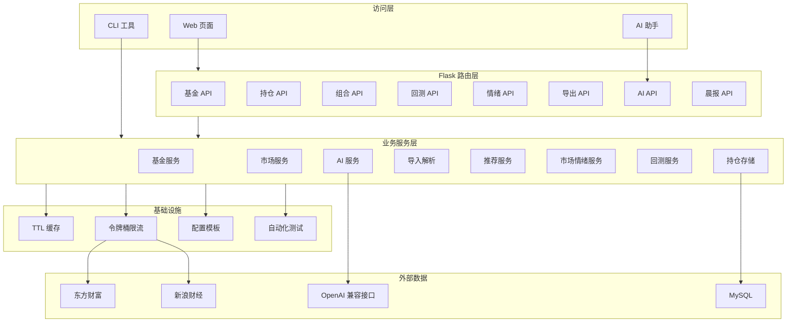
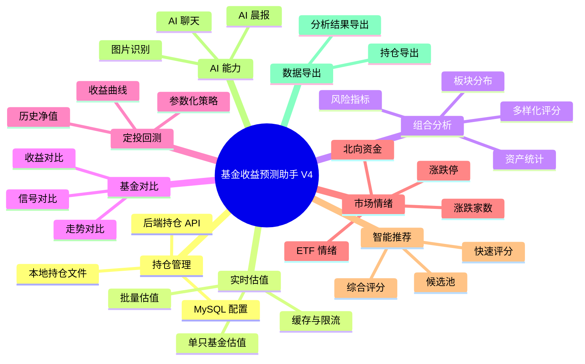
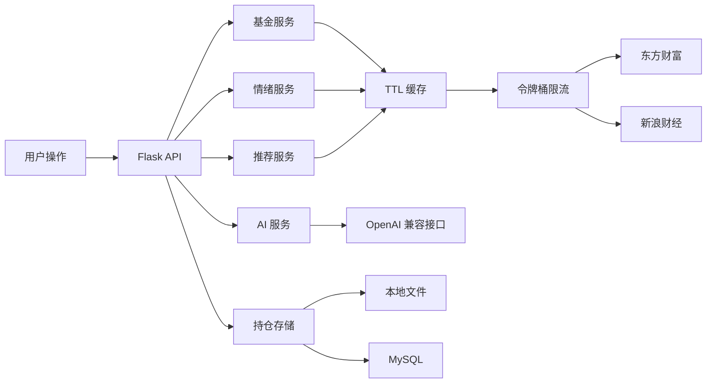

# 基金收益预测助手 V4 项目图示

本文档保存 V4 版本的可编辑图示源码。README 中使用的位图位于 `docs/images/`。

## 系统架构图

```mermaid
flowchart TB
    subgraph Access[访问层]
        Web[Web 页面]
        CLI[CLI 工具]
        AIPanel[AI 助手]
    end

    subgraph Routes[Flask 路由层]
        Fund[基金 API]
        Holding[持仓 API]
        Portfolio[组合 API]
        Backtest[回测 API]
        Sentiment[情绪 API]
        Export[导出 API]
        AI[AI API]
        Report[晨报 API]
    end

    subgraph Services[业务服务层]
        FundSvc[基金服务]
        MarketSvc[市场服务]
        HoldingStore[持仓存储]
        ImportSvc[导入解析]
        Recommend[推荐服务]
        SentimentSvc[市场情绪服务]
        BacktestSvc[回测服务]
        AISvc[AI 服务]
    end

    subgraph Infra[基础设施]
        Cache[TTL 缓存]
        Limit[令牌桶限流]
        Config[配置模板]
        Tests[自动化测试]
    end

    subgraph External[外部数据]
        Eastmoney[东方财富]
        Sina[新浪财经]
        OpenAI[OpenAI 兼容接口]
        MySQL[MySQL]
    end

    Web --> Routes
    CLI --> Services
    AIPanel --> AI

    Routes --> Services
    Services --> Cache
    Services --> Limit
    Services --> Config
    Services --> Tests

    Limit --> Eastmoney
    Limit --> Sina
    AISvc --> OpenAI
    HoldingStore --> MySQL
```

## 功能图

```mermaid
mindmap
  root((基金收益预测助手 V4))
    持仓管理
      后端持仓 API
      本地持仓文件
      MySQL 配置
    实时估值
      单只基金估值
      批量估值
      缓存与限流
    组合分析
      资产统计
      板块分布
      风险指标
      多样化评分
    基金对比
      收益对比
      走势对比
      信号对比
    定投回测
      参数化策略
      历史净值
      收益曲线
    市场情绪
      涨跌家数
      涨跌停
      ETF 情绪
      北向资金
    智能推荐
      候选池
      快速评分
      综合评分
    AI 能力
      AI 聊天
      图片识别
      AI 晨报
    数据导出
      持仓导出
      分析结果导出
```

## 数据流图

```mermaid
flowchart LR
    User[用户操作] --> API[Flask API]
    API --> FundSvc[基金服务]
    API --> SentimentSvc[情绪服务]
    API --> RecommendSvc[推荐服务]
    API --> AISvc[AI 服务]

    FundSvc --> Cache[TTL 缓存]
    SentimentSvc --> Cache
    RecommendSvc --> Cache

    Cache --> Limit[令牌桶限流]
    Limit --> Eastmoney[东方财富]
    Limit --> Sina[新浪财经]
    AISvc --> OpenAI[OpenAI 兼容接口]

    API --> HoldingStore[持仓存储]
    HoldingStore --> Local[本地文件]
    HoldingStore --> MySQL[MySQL]
```
